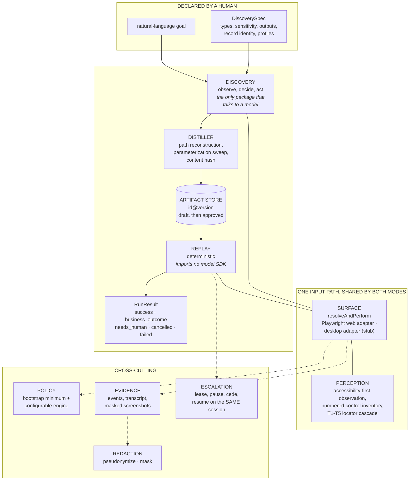

# MERIDIAN - hands for an AI agent inside legacy banking software

This is the backend layer that lets an AI agent operate a legacy banking application that has no
API. A model **discovers** how to do a job by driving the live UI - observing, deciding, acting -
until a natural-language goal is met. That successful run is **distilled** into a typed, versioned,
parameterized capability artifact. The artifact then **replays deterministically, with no model in
the decision loop**, which is how an agent invokes the capability in production. The model
discovers; the artifact becomes a reusable capability; deterministic replay is how it gets called.

**In a hurry?** [The demo path](#the-demo-path) runs from a clean clone, needs no API key, and shows
every claim below actually working. [Real, and deliberately not](#real-and-deliberately-not) says
what is genuine and what is a stand-in.

---

## Architecture



The **contract** is declared by a human: types, sensitivity, outputs, record identity, and the
conditions the system is allowed to recognise. The **path** is discovered by the model. The model
never authors a selector - it picks from a numbered inventory of perceived controls, and those
numbers structurally cannot reach the artifact.

---

## Real, and deliberately not

| Thing                              | State                                                                                                                                                                                                                                                                                                                                                                                                                                                              |
| ---------------------------------- | ------------------------------------------------------------------------------------------------------------------------------------------------------------------------------------------------------------------------------------------------------------------------------------------------------------------------------------------------------------------------------------------------------------------------------------------------------------------ |
| Accessibility-first perception     | **Real.** CDP AX tree per frame, DOM enrichment, no CSS selector as evidence                                                                                                                                                                                                                                                                                                                                                                                       |
| The T1-T5 locator cascade          | **Real**, and the tier actually used is asserted per control in evidence                                                                                                                                                                                                                                                                                                                                                                                           |
| Discovery against a live UI        | **Real.** A model drives a real browser. Two gate runs are written up                                                                                                                                                                                                                                                                                                                                                                                              |
| Distillation and content hashing   | **Real.** Approval is a status flip that does not move the content hash                                                                                                                                                                                                                                                                                                                                                                                            |
| Deterministic replay               | **Real.** Zero model calls, proven architecturally and by a call counter                                                                                                                                                                                                                                                                                                                                                                                           |
| Business outcomes and recoveries   | **Real**, driven by the pinned condition profile against a live fixture                                                                                                                                                                                                                                                                                                                                                                                            |
| The safety policy                  | **Real**, in two layers. Irreversible actions are always blocked                                                                                                                                                                                                                                                                                                                                                                                                   |
| Pseudonymization and masking       | **Real.** Masking is verified in pixels, not by inspecting a manifest                                                                                                                                                                                                                                                                                                                                                                                              |
| Human handoff on the same session  | **Real.** Same browser context and page target, evidenced before and after                                                                                                                                                                                                                                                                                                                                                                                         |
| The operator console               | **Real but minimal by choice.** Loopback, token-gated, four routes, no live input forwarding                                                                                                                                                                                                                                                                                                                                                                       |
| **The legacy banking application** | **A fixture.** Written for this project: frames, table-laid-out labels, ASP-style `name=`, no test ids, class names randomized per boot. Every record in it is invented and stamped `DUMMY DATA - NOT REAL`                                                                                                                                                                                                                                                        |
| **The desktop adapter**            | **A stub.** It compiles, it throws, and it documents the real UI Automation call for every method. It proves the `Surface` contract is expressible without a browser and nothing more                                                                                                                                                                                                                                                                              |
| **A second capability**            | **Specified and demonstrated in a test, with no artifact anywhere.** `config/specs/lookup_member_savings_balance.yaml` is a real spec that runs end to end under `tests/integration/agent.second-capability.live.test.ts` - no schema or engine change was needed. There is no approved artifact for it, `npm run demo:store` seeds only the first capability, and it has no scenario in the evidence bundle. `REPORT.md` section 7 and `DECISIONS.md` D97 say why |
| **A second tenant**                | **Not built.** `semanticKey` exists on the descriptor and nothing reads it yet                                                                                                                                                                                                                                                                                                                                                                                     |
| **`npm run operator`**             | **Not built.** It exits 2 and says so. The handoff needs no separate command                                                                                                                                                                                                                                                                                                                                                                                       |
| **Durable storage**                | **Not built.** Artifacts are files; the store refuses to overwrite a published version                                                                                                                                                                                                                                                                                                                                                                             |
| **Enterprise identity**            | **Not built.** The fixture accepts any non-empty credential pair and no credential is stored in this repository                                                                                                                                                                                                                                                                                                                                                    |

`REPORT.md` section 7 says what would come first with another week.

---

## Setup

```bash
npm install
```

```bash
npx playwright install chromium
```

Node 20 or newer.

### Running without an API key

**Replay and the entire test suite need no API key.** Only discovery calls a model, and only because
discovery is the part where a model is the point.

```bash
npm test
```

That is 546 tests across 57 files, browsers and CLIs included, and not one of them contacts a
provider. It takes two to four minutes depending on the machine. `npm run test:fast` is the
browser-free subset and finishes in about twelve seconds.

For a model run, copy `.env.example` to `.env` and set `ANTHROPIC_API_KEY` and `LLM_MODEL`. Nothing
else in this repository reads either variable.

---

## The demo path

Copy-pasteable, in order. Two terminals.

Output blocks below show what to expect. The step table in step 3 is verbatim from a real replay;
seeds, ports, run ids and tokens differ on every run, so treat those as shape rather than as values
to compare against.

### 1. Put a replayable capability in place

```bash
npm run demo:store
```

`/artifacts` holds run output and is gitignored, so a fresh clone has no capability in it. This
copies the **tracked** example into `artifacts-demo/`, a throwaway store. Never into `artifacts/`: a
published version there is immutable and seeding it would make the next real discovery refuse to
write.

> Copied the tracked example capability into artifacts-demo/.

### 2. Start the legacy application

```bash
npm run dev:app-a
```

> MERIDIAN Core Servicing listening on http://localhost:4180 (obfuscation seed 1839221755)

(a different number every boot)

**Write the seed down.** Every CSS class name and element id in the application is regenerated from
it on each boot. Every role, accessible name and legacy `name=` attribute stays exactly where it was.

### 3. Replay the capability

In a second terminal:

```bash
npm run replay -- --artifact prepare_subaccount_review@1.0.0 --artifacts artifacts-demo --params '{"memberId":"10001","accountType":"Savings","initialDeposit":"250.00"}'
```

A browser opens and drives itself through search, the member record, the sub-account form and the
review screen. It stops there. It never submits.

> ```
> step-1-enter-member-id      performed  T1_EXACT_ROLE_NAME
> step-2-search               performed  T1_EXACT_ROLE_NAME
> step-3-open-member          performed  T5_STRUCTURAL_ROW
> step-4-open-subaccount-form performed  T1_EXACT_ROLE_NAME
> step-5-choose-account-type  performed  T3_EXTERNAL_LABEL_OR_NEARBY
> step-6-enter-nickname       performed  T3_EXTERNAL_LABEL_OR_NEARBY
> step-7-enter-deposit        performed  T3_EXTERNAL_LABEL_OR_NEARBY
> step-8-continue-to-review   performed  T1_EXACT_ROLE_NAME
>
> llm calls: 0
> ```

The tier column is the interesting one. `T1` is role plus exact accessible name. `T3` is the label in
the cell to the left, which is how a form laid out in a 1990s `<table>` is addressed. `T5` walks to
the row whose key cell matches the member id and then to the control inside it. No CSS selector is
recorded anywhere in the artifact.

### 4. Restart the fixture and do it again

Stop the fixture with Ctrl+C and start it again:

```bash
npm run dev:app-a
```

> MERIDIAN Core Servicing listening on http://localhost:4180 (obfuscation seed 402117389)

**A different seed.** Every class name and element id in the application is now different. Run the
same replay command from step 3. It produces the same result, at the same tiers.

This is the step that distinguishes accessibility-first perception from a recorded-selector script,
and it is why the fixture randomizes per boot. It still proves less than it looks on its own - the
fixture deliberately keeps its legacy-stable ASP `name=` attributes, and a replay that resolved
everything through those would also survive. That is why the tier column above is checked
individually, and why `npm run evidence:verify` asserts it rather than just asserting success.

### 5. A negative answer is not a failure

```bash
npm run replay -- --artifact prepare_subaccount_review@1.0.0 --artifacts artifacts-demo --params '{"memberId":"99999","accountType":"Savings","initialDeposit":"250.00"}'
```

> `prepare_subaccount_review@1.0.0 returned a BUSINESS OUTCOME: MEMBER_NOT_FOUND`

Exit code **10**, not 30. The automation worked and the answer is no. There is no `RECORD_NOT_FOUND`
error anywhere in the type system, so a caller cannot page somebody over a wrong member id. It comes
back in a couple of seconds rather than at the end of a timeout, because the detectors run inside the
wait.

### 6. A condition the automation clears itself

```bash
npm run replay -- --artifact prepare_subaccount_review@1.0.0 --artifacts artifacts-demo --params '{"memberId":"10004","accountType":"Checking","initialDeposit":"75.00"}'
```

Member 10004 raises the scheduled-maintenance notice, which the pinned condition profile describes as
a recovery. The run dismisses it, **re-observes**, and rechecks the effect of the step it was in the
middle of - it does not repeat the click, because the click had already worked.

> `recoveries attempted: DISMISS_MAINTENANCE_NOTICE (at step-4-open-subaccount-form)`

### 7. A hard failure that tells you what to do

```bash
npm run replay -- --artifact prepare_subaccount_review@1.0.0 --artifacts artifacts-demo --params '{"memberId":"10003","accountType":"Savings","initialDeposit":"250.00"}'
```

> ```
> prepare_subaccount_review@1.0.0 FAILED: PERMISSION_DENIED
> expected:  the screen is "Member Record"
> observed:  The signed-on operator is not entitled to view this member.
>            Remediation is an entitlement change, not a retry.
> ```

Exit **30**. Expected beside observed, because one half of a disagreement is not a diagnosis.

### 8. Hand control to a person, and take it back

```bash
npm run replay -- --artifact prepare_subaccount_review@1.0.0 --artifacts artifacts-demo --params '{"memberId":"20001","accountType":"Savings","initialDeposit":"250.00"}'
```

Member 20001 raises a compliance modal the pinned profile deliberately does **not** describe. The run
stops and prints a console URL and, on a separate line, a token:

> ```
> An operator is needed.
>   url:    http://127.0.0.1:58220/i/iv_6bd9d88ae1f349e0976b39
>   token:  xTxpsxHiz2kGIXL-YZsH7l3VNTkV6awQB5EpmHmTjvI
>   why:    a blocking dialog ("Compliance attestation required") is displayed
> ```

Open the URL, paste the token, and look at the masked live view. Then, **in the browser window that
is already open in front of you**, type the attestation code shown in the modal and submit it. That
window is the run: the same browser context, the same page, still signed on.

Press **Resume**. There is no "mark complete" and no endpoint that would accept one. The system
re-observes, works out where it is, finishes the form and declares the outcome itself, recording
`completionMode: 'human_assisted'`.

Pressing Resume without clearing the modal is worth trying: it tells you the blocker is still there
and gives control back rather than resuming into it.

### 9. Discovery, if you want to pay for it

```bash
npm run discover -- --spec config/specs/prepare_subaccount_review.yaml --target tenant-a --inputs '{"memberId":"10001","accountType":"Savings","nickname":"Holiday Fund","initialDeposit":"250.00"}'
```

One model, one live UI, roughly ten calls and a couple of cents. It writes a **draft** capability;
`npm run capability:approve -- <id>@<version> --by "<name>"` flips the status and prints the content
hash before and after, which are identical.

---

## Evidence

```bash
npm run evidence:automated
```

```bash
npm run evidence:handoff
```

```bash
npm run evidence:verify
```

`npm run evidence:readme` regenerates the bundle's README from the runs already in it, without
running anything.

The first makes one real discovery, approves the result, **restarts the fixture with a new seed**,
and runs five replays; the second is the scenario that needs a person; the third is the gate and
needs no key. Output lands in `/evidence/<scenario>/<runId>/` with an index in
`/evidence/manifest.json`.

`evidence/README.md` explains each scenario, what it proves, which files to read, and what the bundle
does **not** prove.

---

## Repository map

| Path             | What is in it                                                                     |
| ---------------- | --------------------------------------------------------------------------------- |
| `src/types`      | the domain model. Business outcomes and errors are separate hierarchies           |
| `src/config`     | environment, spec loading, canonical serialization and `specHash`                 |
| `src/surface`    | surface adapters and `resolveAndPerform`, the only way an action reaches a screen |
| `src/perception` | accessibility-first observation and the T1-T5 resolver cascade                    |
| `src/session`    | session state machine and lease tokens                                            |
| `src/artifact`   | capability schema, distillation, content hashing, approval, profile pins          |
| `src/agent`      | the discovery loop. The **only** package that talks to a model                    |
| `src/replay`     | deterministic re-execution. Imports neither `src/agent` nor any model SDK         |
| `src/policy`     | the bootstrap safety minimum and the configurable engine that runs alongside it   |
| `src/redaction`  | persistence pseudonymization and declared-box screenshot masking                  |
| `src/escalation` | handoff, resume reconciliation, operator console                                  |
| `src/evidence`   | run evidence capture                                                              |
| `src/cli`        | `discover`, `replay`, `capability:approve`                                        |
| `fixtures/`      | the legacy banking application this is built against                              |
| `config/`        | the spec, and the **immutable** versioned condition and safety profiles           |
| `tests/`         | `unit` and `contract` need no browser; `integration` is everything that does      |
| `docs/`          | schema, status, test map, data handling, decisions                                |

## Exit codes

| Code | Status             | Meaning                                                          |
| ---- | ------------------ | ---------------------------------------------------------------- |
| 0    | `success`          | the work is done                                                 |
| 10   | `business_outcome` | the automation worked and the answer is negative                 |
| 20   | `needs_human`      | something is in the way that nobody described                    |
| 25   | `cancelled`        | a person decided to stop. Not a malfunction                      |
| 30   | `failed`           | the automation, the surface, the contract or a guardrail said no |

10 is separate from 30 on purpose.

## Documents

| File                    | What it is                                                             |
| ----------------------- | ---------------------------------------------------------------------- |
| `REPORT.md`             | the design write-up: decisions, costs, and what was cut                |
| `docs/DECISIONS.md`     | the calls that could have gone the other way, as ADRs                  |
| `DECISIONS.md`          | the full build log those ADRs were distilled from                      |
| `docs/SCHEMA.md`        | the capability artifact, annotated field by field                      |
| `docs/STATUS.md`        | what is built, how it works, and how to check each part                |
| `docs/TEST_MAP.md`      | requirement to test, with an honest strength, and what is thin         |
| `docs/DATA_HANDLING.md` | what is stored, pseudonymized, masked, never captured - and the LIMITS |
| `evidence/README.md`    | the evidence bundle, scenario by scenario                              |
